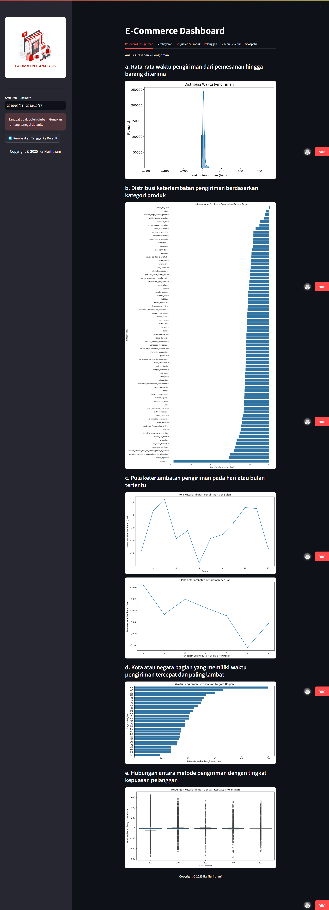
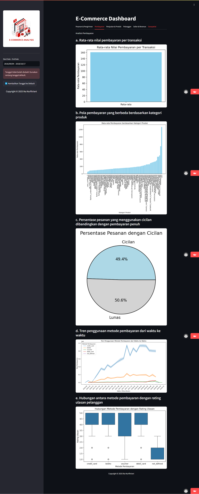
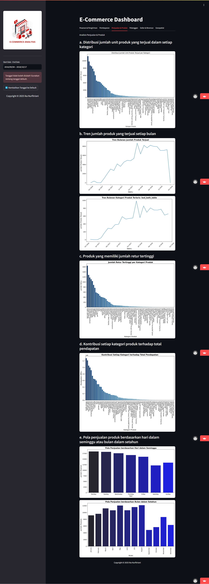
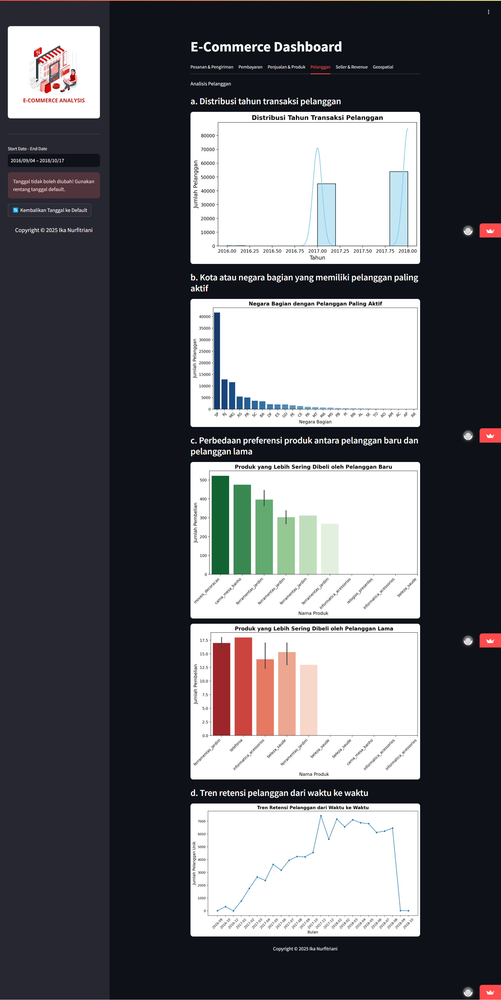
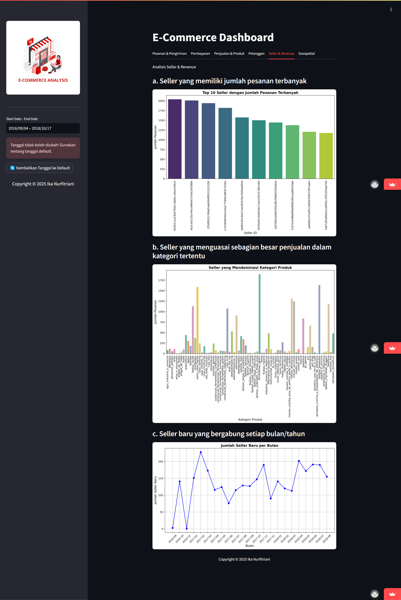
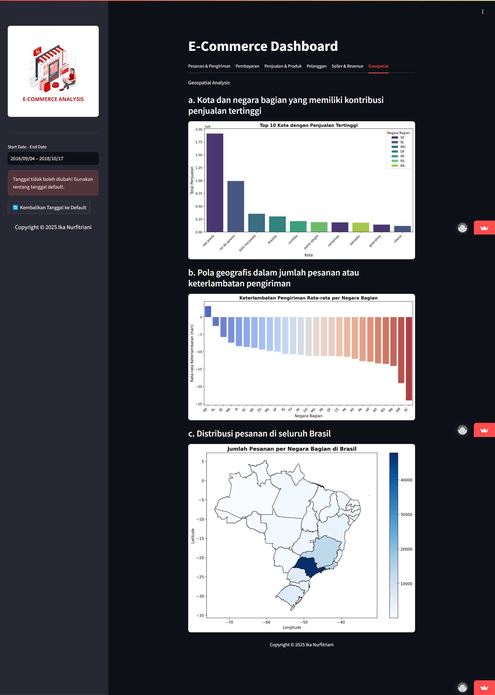

# E-Commerce-Analysis
This repository contains code archives for E-Commerce Analysis.

## Deployment
Link deployment for public: https://e-commerce-analysis-by-ika.streamlit.app/

## Directory Structure
```bash
E-Commerce-Analysis/
│
├── SS/                 
│   ├── SS1.png
│   ├── SS2.png
│   ├── SS3.png
│   ├── SS4.png
│   ├── SS5.png
│   └── SS6.png
│
├── dashboard/                 
│   ├── e-commerce.png
│   ├── dashboard.py
│   └── main_data
│       ├── category_translation_cleaned.csv
│       ├── customers_cleaned.csv
│       ├── geolocation_cleaned.csv
│       ├── order_items_cleaned.csv
│       ├── order_payments_cleaned.csv
│       ├── order_reviews_cleaned.csv
│       ├── orders_cleaned.csv
│       ├── products_cleaned.csv
│       └── sellers_cleaned.csv
│
├── data/
│   ├── customers_dataset.csv
│   ├── geolocation_dataset.csv
│   ├── order_items_dataset.csv
│   ├── order_payments_dataset.csv
│   ├── order_reviews_dataset.csv
│   ├── orders_dataset.csv
│   ├── product_category_name_translation.csv
│   ├── products_dataset.csv
│   └── sellers_dataset.csv
│
├── LICENSE.txt
├── README.md
├── requirements.txt
└── url.txt
```

## Project Setup / Installation Instructions
1. Clone the repository from GitHub:  
   ```
   git clone https://github.com/ikanurfitriani/E-Commerce-Analysis.git
   ```

2. Navigate to the project directory:  
   ```
   cd E-Commerce-Analysis
   ```

3. Install the required dependencies:  
   ```
   pip install -r requirements.txt
   ```

4. Navigate to the dashboard directory:  
   ```
   cd dashboard
   ```

5. Run the Streamlit application:  
   ```
   streamlit run dashboard.py
   ```

## Screen Capture
The following is a screen capture from the E-Commerce Analysis dashboard:
- `SS` <br>
<br>
<br>


## Author
[@Ika Nurfitriani](https://github.com/ikanurfitriani)